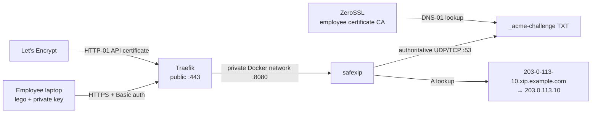

# safexip

safexip is a small authoritative DNS server for teams that need independently held wildcard certificates. It serves xip-style IPv4 records and exposes the exact DNS-01 API expected by lego's `httpreq` provider.

Each employee runs lego on their own computer. Their ACME account, certificate, and private key stay on that computer; safexip stores only short-lived DNS challenge values. Multiple simultaneous challenges are published as separate TXT records, and abandoned values expire after ten minutes by default.

## Architecture



The public HTTP API must always be behind HTTPS. HTTP Basic authentication only encodes the password; it does not encrypt it. The Compose deployment below does not publish safexip's port 8080. Traefik is the only public HTTP entry point and reaches safexip over a private Docker network.

The deployment deliberately uses two certificate authorities. Traefik uses Let's Encrypt HTTP-01 for the API endpoint's server certificate. Employees use ZeroSSL DNS-01 as the primary workflow for independently held wildcard certificates. Either CA produces publicly trusted certificates; their ACME accounts and local data must not share a lego storage directory.

## What safexip serves

For a delegated zone named `xip.example.com`:

| Query | Response |
|---|---|
| `203-0-113-10.xip.example.com` A | `203.0.113.10` |
| `_acme-challenge.xip.example.com` TXT | One record per active ACME value |
| `xip.example.com` NS / SOA | Authoritative zone records |
| Existing name with an unsupported type | NODATA |
| Unknown name inside the zone | `NXDOMAIN` |
| Name outside the zone | `REFUSED` |

DNS is served over UDP and TCP. Oversized UDP responses are truncated so resolvers retry over TCP.

## Complete Ubuntu, Docker, Traefik, and Let's Encrypt setup

This walkthrough starts with a fresh Ubuntu 24.04 or 26.04 server with a static public IPv4 address assigned directly to a server interface. Replace these documentation values everywhere:

| Example value | Replace with |
|---|---|
| `203.0.113.10` | Server's static public IPv4 address |
| `xip.example.com` | Subdomain delegated to safexip |
| `ns1.xip.example.com` | First in-zone nameserver name |
| `ns2.xip.example.com` | Second in-zone nameserver name |
| `203-0-113-10.xip.example.com` | Public API hostname: public IPv4 with dots changed to hyphens, followed by the safexip zone |
| `admin@example.com` | Address used for Traefik's Let's Encrypt account |

The encoded API hostname needs no separate A record. Once safexip is authoritative, its xip-style lookup resolves that hostname to the server itself.

### 1. Prepare the server and firewall

Create an Ubuntu server with a static IPv4 address. Allow these inbound connections in the cloud-provider firewall:

| Protocol | Port | Source | Purpose |
|---|---:|---|---|
| TCP | 22 | Administrative networks only | SSH |
| UDP | 53 | Anywhere | DNS |
| TCP | 53 | Anywhere | DNS fallback and large answers |
| TCP | 80 | Anywhere | Traefik redirect and ACME HTTP-01 |
| TCP | 443 | Anywhere | Employee-facing HTTPS API |

Do not expose port 8080 or 18080 publicly.

Docker-published ports can bypass uncomplicated `ufw` rules. Treat the provider firewall as the primary boundary, and consult Docker's [packet-filtering and firewall guidance](https://docs.docker.com/engine/network/packet-filtering-firewalls/) before adding host-level policy.

Confirm that nothing already owns the required ports:

```bash
sudo ss -lntup | grep -E ':(53|80|443) ' || true
```

Ubuntu's `systemd-resolved` normally listens only on loopback. The Compose file binds DNS to the server's specific public address so it does not claim the loopback listeners.

### 2. Install Docker Engine and Compose

Use Docker's official apt repository rather than Ubuntu's older `docker.io` package. These commands follow Docker's [Ubuntu installation guide](https://docs.docker.com/engine/install/ubuntu/):

```bash
sudo apt-get update
sudo apt-get install -y ca-certificates curl dnsutils openssl

sudo install -m 0755 -d /etc/apt/keyrings
sudo curl -fsSL https://download.docker.com/linux/ubuntu/gpg \
  -o /etc/apt/keyrings/docker.asc
sudo chmod a+r /etc/apt/keyrings/docker.asc

. /etc/os-release
docker_codename="${UBUNTU_CODENAME:-$VERSION_CODENAME}"
docker_arch="$(dpkg --print-architecture)"
printf '%s\n' \
  'Types: deb' \
  'URIs: https://download.docker.com/linux/ubuntu' \
  "Suites: ${docker_codename}" \
  'Components: stable' \
  "Architectures: ${docker_arch}" \
  'Signed-By: /etc/apt/keyrings/docker.asc' \
  | sudo tee /etc/apt/sources.list.d/docker.sources >/dev/null

sudo apt-get update
sudo apt-get install -y \
  docker-ce docker-ce-cli containerd.io \
  docker-buildx-plugin docker-compose-plugin
sudo systemctl enable --now docker

sudo docker version
sudo docker compose version
```

The examples use `sudo docker`. Membership in the `docker` group is effectively root-equivalent and is not required for this deployment.

### 3. Create the deployment directory

```bash
sudo install -d -m 0750 /opt/safexip
sudo install -d -m 0700 /opt/safexip/letsencrypt
sudo install -m 0600 /dev/null /opt/safexip/letsencrypt/acme.json
cd /opt/safexip
```

Create `/opt/safexip/.env`:

```bash
sudoedit /opt/safexip/.env
```

```dotenv
PUBLIC_IP=203.0.113.10
SAFEXIP_ZONE=xip.example.com
SAFEXIP_NS1=ns1.xip.example.com
SAFEXIP_NS2=ns2.xip.example.com
SAFEXIP_API_HOST=203-0-113-10.xip.example.com
LETSENCRYPT_EMAIL=admin@example.com
```

Protect it:

```bash
sudo chown root:root /opt/safexip/.env
sudo chmod 0600 /opt/safexip/.env
```

Generate the shared API key directly into `/opt/safexip/safexip.env` without printing it to the terminal:

```bash
umask 077
printf 'SAFEXIP_API_KEY=%s\nRUST_LOG=safexip=info\n' \
  "$(openssl rand -hex 32)" \
  | sudo tee /opt/safexip/safexip.env >/dev/null
sudo chown root:root /opt/safexip/safexip.env
sudo chmod 0600 /opt/safexip/safexip.env
```

Store this key in the company's password manager. Do not send it through email, chat, issue trackers, or shell-history arguments.

### 4. Create the Compose file

Create `/opt/safexip/compose.yml`:

```yaml
name: safexip

services:
  traefik:
    image: traefik:v3.7.8@sha256:4299bbed850421258fc5448c2e0e6ad350981d4d335a68de11b92448aedbefe5
    container_name: safexip-traefik
    restart: unless-stopped
    command:
      - --providers.docker=true
      - --providers.docker.exposedbydefault=false
      - --entrypoints.web.address=:80
      - --entrypoints.websecure.address=:443
      - --entrypoints.web.http.redirections.entrypoint.to=websecure
      - --entrypoints.web.http.redirections.entrypoint.scheme=https
      - --entrypoints.web.http.redirections.entrypoint.permanent=true
      - --certificatesresolvers.letsencrypt.acme.email=${LETSENCRYPT_EMAIL}
      - --certificatesresolvers.letsencrypt.acme.storage=/letsencrypt/acme.json
      - --certificatesresolvers.letsencrypt.acme.httpchallenge=true
      - --certificatesresolvers.letsencrypt.acme.httpchallenge.entrypoint=web
    ports:
      - ${PUBLIC_IP}:80:80/tcp
      - ${PUBLIC_IP}:443:443/tcp
    volumes:
      - /var/run/docker.sock:/var/run/docker.sock:ro
      - ./letsencrypt:/letsencrypt
    networks:
      - proxy
    security_opt:
      - no-new-privileges:true
    logging:
      driver: json-file
      options:
        max-size: 10m
        max-file: "3"

  safexip:
    image: ineentho/safexip:0.2.0@sha256:3a1e7c6e97af44beadea0438d6a589c4856bb158cd9bbfda94940c6a47b85b16
    container_name: safexip
    restart: unless-stopped
    env_file:
      - ./safexip.env
    environment:
      SAFEXIP_DOMAIN: ${SAFEXIP_ZONE}
      SAFEXIP_NS_HOSTNAME: ${SAFEXIP_NS1}
      SAFEXIP_NS_HOSTNAME2: ${SAFEXIP_NS2}
      SAFEXIP_NS_IP: ${PUBLIC_IP}
      SAFEXIP_DNS_BIND: 0.0.0.0
      SAFEXIP_DNS_PORT: "53"
      SAFEXIP_API_BIND: 0.0.0.0
      SAFEXIP_API_PORT: "8080"
    ports:
      - ${PUBLIC_IP}:53:53/udp
      - ${PUBLIC_IP}:53:53/tcp
    user: "10001:10001"
    cap_drop:
      - ALL
    cap_add:
      - NET_BIND_SERVICE
    security_opt:
      - no-new-privileges:true
    read_only: true
    tmpfs:
      - /tmp:size=1m,mode=1777
    mem_limit: 128m
    cpus: 1.0
    pids_limit: 128
    stop_grace_period: 15s
    networks:
      - proxy
    labels:
      traefik.enable: "true"
      traefik.docker.network: safexip_proxy
      traefik.http.routers.safexip-api.rule: Host(`${SAFEXIP_API_HOST}`)
      traefik.http.routers.safexip-api.entrypoints: websecure
      traefik.http.routers.safexip-api.tls: "true"
      traefik.http.routers.safexip-api.tls.certresolver: letsencrypt
      traefik.http.routers.safexip-api.middlewares: safexip-api-ratelimit
      traefik.http.middlewares.safexip-api-ratelimit.ratelimit.average: "5"
      traefik.http.middlewares.safexip-api-ratelimit.ratelimit.burst: "10"
      traefik.http.services.safexip-api.loadbalancer.server.port: "8080"
    logging:
      driver: json-file
      options:
        max-size: 10m
        max-file: "3"

networks:
  proxy:
```

This configuration intentionally does not enable Traefik's insecure dashboard and does not publish safexip's API port. Traefik discovers the internal service from Docker labels. The Docker socket grants Traefik significant control-plane visibility even when mounted read-only; use a Docker socket proxy if your threat model requires stronger isolation.

Validate and pull before starting anything:

```bash
cd /opt/safexip
sudo docker compose config --quiet
sudo docker compose pull
```

### 5. Start authoritative DNS first

Start only safexip. Delaying Traefik prevents premature production ACME attempts while DNS delegation is incomplete.

```bash
cd /opt/safexip
sudo docker compose up -d safexip
sudo docker compose ps
sudo docker compose logs --no-color --tail 50 safexip
```

Test the server directly, substituting its public IPv4 address:

```bash
dig @203.0.113.10 127-0-0-1.xip.example.com A +short
dig @203.0.113.10 127-0-0-1.xip.example.com A +tcp +short
```

Both commands must return `127.0.0.1`.

### 6. Delegate the zone

In the authoritative provider for `example.com`, create these records with proxying disabled:

```text
ns1.xip.example.com.  A   203.0.113.10
ns2.xip.example.com.  A   203.0.113.10
xip.example.com.      NS  ns1.xip.example.com.
xip.example.com.      NS  ns2.xip.example.com.
```

These A records are in-bailiwick glue. Some registrars or DNS providers expose glue through a separate “register nameserver” interface.

Both nameserver names point to one server in this minimal deployment. That provides protocol compatibility, not redundancy. Some parent zones require nameservers on distinct addresses, and a production zone that must survive a host or network failure needs a second authoritative server on independent infrastructure.

Wait until public resolvers see the delegation and encoded API hostname:

```bash
dig @1.1.1.1 xip.example.com NS +short
dig @8.8.8.8 xip.example.com NS +short
dig @1.1.1.1 203-0-113-10.xip.example.com A +short
dig @8.8.8.8 203-0-113-10.xip.example.com A +short
```

Do not continue until both resolvers return the two safexip nameservers and `203.0.113.10`.

### 7. Start Traefik and obtain HTTPS

Traefik uses HTTP-01 to obtain a certificate for `203-0-113-10.xip.example.com`. Ports 80 and 443 must reach this server, and the encoded hostname must already resolve publicly.

```bash
cd /opt/safexip
sudo docker compose up -d
sudo docker compose ps
sudo docker compose logs --no-color --tail 100 traefik
```

Verify HTTPS from a different network if possible:

```bash
curl --fail --show-error --silent \
  https://203-0-113-10.xip.example.com/health

curl --head http://203-0-113-10.xip.example.com/health
```

The health request returns:

```json
{"status":"ok","domain":"xip.example.com"}
```

The HTTP request must redirect to HTTPS. A request with the wrong password must return `401`:

```bash
curl --output /dev/null --silent --write-out '%{http_code}\n' \
  --user safexip:incorrect \
  --header 'Content-Type: application/json' \
  --data '{"fqdn":"_acme-challenge.xip.example.com.","value":"must-not-publish"}' \
  https://203-0-113-10.xip.example.com/present
```

Never add a public `8080:8080` or `18080:8080` mapping. The password is protected in transit because employees communicate only with Traefik over verified HTTPS.

### 8. Give employees controlled access

safexip 0.2.0 has one shared API key. Store it in a company password manager and grant access only to employees allowed to request certificates for this zone. Anyone with the key can temporarily publish `_acme-challenge.xip.example.com` values and obtain certificates for the zone.

Each employee should save the key as a protected file on their computer:

```bash
install -d -m 0700 "${HOME}/.config/safexip"
install -m 0600 /dev/null "${HOME}/.config/safexip/api-key"
```

Use a password-manager CLI or a secure editor to place only the API key in that file. Do not include `SAFEXIP_API_KEY=` and do not add a trailing comment.

Install Docker Desktop on macOS/Windows, or Docker Engine on Linux. Then create a private lego data directory:

```bash
install -d -m 0700 "${HOME}/.local/share/safexip/lego"
```

Issue a separate certificate from the employee's computer. The primary employee workflow uses ZeroSSL:

```bash
docker run --rm \
  --volume "${HOME}/.local/share/safexip/lego:/data" \
  --volume "${HOME}/.config/safexip/api-key:/run/secrets/safexip-api-key:ro" \
  --env HTTPREQ_ENDPOINT=https://203-0-113-10.xip.example.com \
  --env HTTPREQ_USERNAME=safexip \
  --env HTTPREQ_PASSWORD_FILE=/run/secrets/safexip-api-key \
  goacme/lego:v5.2.2@sha256:d621ec01f3ca272d259a62e3e00be901293c2901ba8fc0214fe0b72523c3c278 \
  run \
  --server zerossl \
  --path /data \
  --email employee@example.com \
  --dns httpreq \
  --domains xip.example.com \
  --domains '*.xip.example.com' \
  --accept-tos
```

This syntax is for lego 5.2.2. In lego 5, issuance options belong after the `run` subcommand. Lego's ZeroSSL integration uses the supplied email to handle account registration and External Account Binding automatically; employees do not need to pre-create a ZeroSSL dashboard account or copy EAB credentials. The `httpreq` provider supports `HTTPREQ_PASSWORD_FILE`, keeping the safexip key out of the command arguments and environment value.

Successful output is stored locally:

```text
~/.local/share/safexip/lego/
├── accounts/                              # Employee's ACME account and key
└── certificates/
    ├── xip.example.com.crt                # Certificate bundle
    ├── xip.example.com.issuer.crt
    ├── xip.example.com.json
    └── xip.example.com.key                # Employee's private key
```

Lock down any files if the local filesystem or Docker implementation changed their modes:

```bash
find "${HOME}/.local/share/safexip/lego" -type d -exec chmod 0700 {} +
find "${HOME}/.local/share/safexip/lego" -type f -exec chmod 0600 {} +
```

Inspect the result:

```bash
openssl x509 \
  -in "${HOME}/.local/share/safexip/lego/certificates/xip.example.com.crt" \
  -noout -subject -issuer -dates -text
```

The SAN extension must contain both `xip.example.com` and `*.xip.example.com`.

#### Optional: use Let's Encrypt for employee certificates

[ZeroSSL's ACME service](https://zerossl.com/documentation/acme/) advertises unlimited free 90-day certificates, including wildcard certificates, which is why it is the primary employee workflow. Let's Encrypt remains fully compatible and is useful as an alternative CA.

To use Let's Encrypt instead, change the employee command to:

```text
--server letsencrypt
```

Use a separate directory such as `~/.local/share/safexip/lego-letsencrypt` and mount it as `/data`. Never point two CAs at the same lego storage directory. Test the chosen CA's full issue-and-renew cycle before standardizing it for the team.

### 9. Renew employee certificates

Run the same `lego run ...` command periodically. Lego 5 removed the separate `renew` command: `run` keeps the existing ACME account, inspects the certificate, renews only when due, and otherwise exits successfully without changing it. Do not delete the employee's lego directory between runs or change its CA.

Schedule it daily or weekly and let lego decide when renewal is due. Certificate lifetimes are changing across the ecosystem, so automation should not assume a fixed 90-day lifetime. Lego 5.2.2 supports ACME Renewal Information (ARI) and dynamically chooses the renewal window when the CA supplies it. Back up the entire lego directory securely; losing it loses the employee's ACME account and private key.

After renewal, reload whichever local application consumes the certificate. safexip and Traefik do not distribute employee private keys and cannot reload that application for you.

### 10. Rotate access when an employee leaves

Generate a new API key on the server, update `/opt/safexip/safexip.env` with a secure editor, and recreate only the safexip container:

```bash
cd /opt/safexip
sudoedit safexip.env
sudo chmod 0600 safexip.env
sudo docker compose up -d --force-recreate safexip
```

Replace the old key in the password manager and distribute it to the remaining authorized employees. Existing certificates continue to work until expiry, but the previous API key can no longer create challenges.

## Verification checklist

Run these after installation, upgrades, firewall changes, or key rotation:

```bash
# Authoritative UDP and TCP DNS
dig @203.0.113.10 127-0-0-1.xip.example.com A +short
dig @203.0.113.10 127-0-0-1.xip.example.com A +tcp +short

# Public delegation
dig @1.1.1.1 xip.example.com NS +short
dig @8.8.8.8 203-0-113-10.xip.example.com A +short

# Trusted HTTPS and redirect
curl --fail --silent https://203-0-113-10.xip.example.com/health
curl --head http://203-0-113-10.xip.example.com/health

# Runtime state
cd /opt/safexip
sudo docker compose ps
sudo docker compose logs --no-color --tail 50 safexip
sudo docker compose logs --no-color --tail 50 traefik
```

An end-to-end lego issuance is the definitive test: it exercises HTTPS authentication, concurrent TXT publication, authoritative and recursive DNS propagation, CA validation, cleanup, and local certificate storage.

## Operations

### Backups

Back up these server files with root-only access:

```text
/opt/safexip/.env
/opt/safexip/safexip.env
/opt/safexip/compose.yml
/opt/safexip/letsencrypt/acme.json
```

`acme.json` contains Traefik's account and private key for the API endpoint. Each employee is independently responsible for backing up their lego directory and private certificate key.

### Upgrade safexip

Update the immutable image tag and digest in `compose.yml`, then:

```bash
cd /opt/safexip
sudo docker compose config --quiet
sudo docker compose pull safexip
sudo docker compose up -d safexip
sudo docker compose logs --no-color --tail 50 safexip
```

Do not use `latest` in production. Release tags, packages, checksums, and image platforms are published on the [GitHub releases page](https://github.com/ineentho/safexip/releases).

### Troubleshooting

| Symptom | Check |
|---|---|
| Container cannot bind port 53 | `sudo ss -lntup | grep ':53 '` |
| Direct DNS works but public DNS fails | Parent NS delegation, in-bailiwick glue, provider proxying, UDP/TCP 53 firewall rules |
| Traefik cannot obtain its certificate | API hostname A lookup, public ports 80/443, `docker compose logs traefik` |
| lego receives `401` | Employee API-key file and current server key |
| lego times out waiting for TXT | `dig @PUBLIC_IP _acme-challenge.ZONE TXT +short` and DNS firewall rules |
| HTTPS works but backend returns `502` | Both containers are attached to `safexip_proxy`, and the service label targets port 8080 |
| Old TXT values remain | They are pruned automatically after `SAFEXIP_TOKEN_LIFETIME`; inspect safexip logs for failed cleanup requests |

Be mindful of the selected CA's policies and rate limits. ZeroSSL asks clients to use its free ACME API meaningfully and may limit abusive automation. When testing the optional Let's Encrypt path repeatedly, use `--server letsencrypt-staging` and a separate disposable lego data directory. Staging certificates are intentionally untrusted; switch back to the intended production CA for final issuance.

## HTTP API

`GET /health` is unauthenticated:

```json
{"status":"ok","domain":"xip.example.com"}
```

`POST /present` and `POST /cleanup` require HTTP Basic authentication. The username is ignored; the password must equal `SAFEXIP_API_KEY`.

```json
{"fqdn":"_acme-challenge.xip.example.com.","value":"base64url-acme-value"}
```

Only the configured zone's exact challenge name is accepted. Tokens must be non-empty DNS TXT strings no longer than 255 bytes. Duplicate values are refreshed, simultaneous values are separate TXT records, active tokens are bounded, and abandoned tokens expire automatically. A presentation is rejected with HTTP 503 before it would make the complete active TXT record set too large for a DNS-over-TCP message; existing records are left unchanged.

The API implements lego's documented [`httpreq` provider](https://go-acme.github.io/lego/dns/httpreq/) endpoints:

- `POST /present`
- `POST /cleanup`

## Configuration

Every option is available as an environment variable or equivalent command-line flag.

| Environment variable | Default | Description |
|---|---|---|
| `SAFEXIP_API_KEY` | required | API secret; at least 32 characters |
| `SAFEXIP_DOMAIN` | `xip.example.com` | Lowercased zone apex; a trailing dot is accepted |
| `SAFEXIP_NS_HOSTNAME` | `ns1.xip.example.com` | Primary in-zone NS name |
| `SAFEXIP_NS_HOSTNAME2` | `ns2.xip.example.com` | Distinct secondary in-zone NS name |
| `SAFEXIP_NS_IP` | `127.0.0.1` | IPv4 glue address for both NS names |
| `SAFEXIP_DNS_BIND` | `0.0.0.0` | DNS listen address |
| `SAFEXIP_DNS_PORT` | `53` | DNS UDP/TCP port |
| `SAFEXIP_API_BIND` | `127.0.0.1` | HTTP API listen address |
| `SAFEXIP_API_PORT` | `8080` | HTTP API port |
| `SAFEXIP_TXT_TTL` | `60` | TXT TTL in seconds, 1–86400 |
| `SAFEXIP_DEFAULT_TTL` | `60` | A/NS TTL in seconds, 1–86400 |
| `SAFEXIP_TOKEN_LIFETIME` | `600` | Token lifetime in seconds, 1–86400 |
| `SAFEXIP_MAX_TOKENS` | `100` | Maximum active tokens, from 1 to the DNS-wire maximum calculated for the configured names |
| `RUST_LOG` | `safexip=info` | Tracing filter; use `safexip=debug` for DNS queries |

Configuration is validated before listeners start. Names are normalized to lowercase, nameservers must be distinct and inside the delegated zone, addresses and ports must parse correctly, and short API keys are rejected. The maximum token count is zone-dependent because DNS name and record overhead consume part of the 65,535-byte TCP message limit; an invalid setting reports the calculated maximum at startup. The count limit is a secondary bound: the API also accounts for the exact active token lengths and DNS message overhead on every presentation.

## Other installation methods

Every release includes static-musl amd64 packages tested in clean containers for these distributions:

| Distribution tested by CI | Package | Service manager |
|---|---|---|
| Debian 12 (Bookworm) | `.deb` | systemd |
| Fedora 43 | `.rpm` | systemd |
| Alpine 3.22 | `.apk` | OpenRC |
| Arch Linux rolling container | `.pkg.tar.zst` | systemd |

All packages install `/usr/bin/safexip` and `/etc/safexip/env`. Debian, Fedora, and Arch packages install `/usr/lib/systemd/system/safexip.service`; Alpine installs `/etc/init.d/safexip`. The systemd unit uses a dynamic unprivileged user with only `CAP_NET_BIND_SERVICE`; the OpenRC package creates an unprivileged `safexip` user and grants the binary only that capability.

Installation deliberately leaves the service stopped because the packaged API key is empty. Configure `/etc/safexip/env`, then enable and start it:

```bash
# Debian, Fedora, or Arch
sudo systemctl enable --now safexip

# Alpine
sudo rc-update add safexip default
sudo rc-service safexip start
```

Upgrades restart safexip only when it was already running. An inactive service remains inactive. Package removal stops and disables the service before removing its service definition.

To build from source, install Rust 1.88 or newer:

```bash
cargo build --release --locked
```

To build Linux packages on an amd64 Linux host, install the Rust `x86_64-unknown-linux-musl` target, a musl linker (the `musl-tools` package on Debian/Ubuntu), and [nFPM](https://nfpm.goreleaser.com/):

```bash
rustup target add x86_64-unknown-linux-musl
make package
```

## Development and releases

Run the same local quality gates as CI:

```bash
make check
```

The release workflow verifies formatting, Clippy, unit and real-listener integration tests, dependency advisories, tag/version equality, static linkage, clean installation of every package format, and systemd/OpenRC upgrade and removal behavior. Its service tests exercise health plus UDP and TCP DNS. It also smoke-tests the exact amd64/arm64 image digests with the documented UID, capabilities, read-only filesystem, and resource limits. Four amd64 Linux packages, checksums, public Docker tags, and the GitHub release are published only after the required checks pass. Before a release, also perform the [delegated-zone ACME staging validation](docs/pre-release-acme.md).

## License

Licensed under either of [Apache License, Version 2.0](LICENSE-APACHE) or
[MIT license](LICENSE-MIT) at your option.
