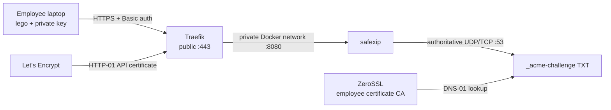

# Production deployment guide

This guide deploys safexip behind Traefik on Ubuntu 24.04 or 26.04. Traefik obtains the API endpoint certificate from Let's Encrypt with HTTP-01; employees obtain independently held wildcard certificates with lego and DNS-01. The public API must always be behind verified HTTPS because HTTP Basic authentication does not encrypt credentials.

The repository copy of this guide and the files under [`deploy/`](../deploy/) are versioned with each release tag. Select the tag matching the release you deploy. Never use `latest` in production.

## Choose the correct procedure

- **[First installation](#first-installation):** creates state only when it is absent. It is safe to rerun the initialization helpers.
- **[Upgrade](#upgrade):** changes the image while preserving configuration, ACME state, and credentials.
- **[Recovery](#recovery):** restores backed-up state before starting containers.
- **[Credential rotation](#credential-rotation):** intentionally replaces credentials. These procedures are explicitly destructive.

Before changing an existing deployment, back up `/opt/safexip` and the employee lego directories described below.

## Architecture and requirements



Use a static public IPv4 address assigned directly to the server. Replace these examples:

| Example | Meaning |
|---|---|
| `203.0.113.10` | Server public IPv4 address |
| `xip.example.com` | Zone delegated to safexip |
| `ns1.xip.example.com`, `ns2.xip.example.com` | In-zone nameserver names |
| `203-0-113-10.xip.example.com` | API hostname encoded from the public IP |
| `admin@example.com` | Traefik ACME account email |

Allow inbound TCP 22 only from administrative networks, UDP/TCP 53 from anywhere, and TCP 80/443 from anywhere. Do not expose port 8080 or 18080. Docker-published ports can bypass `ufw`; treat the provider firewall as the primary boundary and review Docker's [firewall guidance](https://docs.docker.com/engine/network/packet-filtering-firewalls/).

Confirm the required public ports are free:

```bash
sudo ss -lntup | grep -E ':(53|80|443) ' || true
```

## First installation

### 1. Install Docker Engine and tools

Follow Docker's [Ubuntu installation guide](https://docs.docker.com/engine/install/ubuntu/). The following commands are for a new server:

```bash
sudo apt-get update
sudo apt-get install -y ca-certificates curl dnsutils openssl
sudo install -m 0755 -d /etc/apt/keyrings
sudo curl -fsSL https://download.docker.com/linux/ubuntu/gpg \
  -o /etc/apt/keyrings/docker.asc
sudo chmod a+r /etc/apt/keyrings/docker.asc

. /etc/os-release
docker_codename="${UBUNTU_CODENAME:-$VERSION_CODENAME}"
docker_arch="$(dpkg --print-architecture)"
printf '%s\n' \
  'Types: deb' \
  'URIs: https://download.docker.com/linux/ubuntu' \
  "Suites: ${docker_codename}" \
  'Components: stable' \
  "Architectures: ${docker_arch}" \
  'Signed-By: /etc/apt/keyrings/docker.asc' \
  | sudo tee /etc/apt/sources.list.d/docker.sources >/dev/null

sudo apt-get update
sudo apt-get install -y docker-ce docker-ce-cli containerd.io \
  docker-buildx-plugin docker-compose-plugin
sudo systemctl enable --now docker
sudo docker version
sudo docker compose version
```

The examples use `sudo docker`; membership in the `docker` group is effectively root-equivalent.

### 2. Install the versioned deployment files

Check out or download the source tag matching the release. The commands below never replace existing deployment files:

```bash
if sudo test -e /opt/safexip/compose.yml; then
  echo 'Preserving existing /opt/safexip/compose.yml'
else
  sudo install -d -m 0750 /opt/safexip
  sudo install -m 0644 deploy/compose.yml /opt/safexip/compose.yml
fi

if sudo test -e /opt/safexip/.env; then
  echo 'Preserving existing /opt/safexip/.env'
else
  sudo install -m 0600 deploy/.env.example /opt/safexip/.env
fi

sudo deploy/initialize.sh /opt/safexip
```

`initialize.sh` creates `letsencrypt/acme.json` and `safexip.env` only when absent. On every later run it prints that existing state is being preserved. It never rotates a key or truncates ACME data.

Edit `/opt/safexip/.env` and replace all documentation values. Replace `REPLACE_WITH_RELEASE_DIGEST` in `SAFEXIP_IMAGE` with the digest published for the selected release:

```bash
sudoedit /opt/safexip/.env
sudo chmod 0600 /opt/safexip/.env /opt/safexip/safexip.env
cd /opt/safexip
sudo docker compose config --quiet
sudo docker compose pull
```

The placeholder is intentionally not a valid digest, so an unpinned production deployment cannot start accidentally. Store the generated `SAFEXIP_API_KEY` from `safexip.env` in the company password manager without putting it in chat, email, issue trackers, or shell-history arguments.

### 3. Start DNS and delegate the zone

Start safexip without Traefik so production ACME requests cannot begin before delegation works:

```bash
cd /opt/safexip
sudo docker compose up -d safexip
sudo docker compose ps
sudo docker compose logs --no-color --tail 50 safexip

dig @203.0.113.10 127-0-0-1.xip.example.com A +short
dig @203.0.113.10 127-0-0-1.xip.example.com A +tcp +short
```

Both queries must return `127.0.0.1`. In the authoritative provider for `example.com`, create these unproxied records:

```text
ns1.xip.example.com.  A   203.0.113.10
ns2.xip.example.com.  A   203.0.113.10
xip.example.com.      NS  ns1.xip.example.com.
xip.example.com.      NS  ns2.xip.example.com.
```

The A records are in-bailiwick glue. Both nameserver names point to one host in this minimal deployment, which is protocol compatibility rather than redundancy.

Wait for public delegation:

```bash
dig @1.1.1.1 xip.example.com NS +short
dig @8.8.8.8 xip.example.com NS +short
dig @1.1.1.1 203-0-113-10.xip.example.com A +short
dig @8.8.8.8 203-0-113-10.xip.example.com A +short
```

Do not proceed until both resolvers return the safexip nameservers and public IP.

### 4. Start HTTPS

```bash
cd /opt/safexip
sudo docker compose up -d
sudo docker compose ps
sudo docker compose logs --no-color --tail 100 traefik

curl --fail --show-error --silent \
  https://203-0-113-10.xip.example.com/health
curl --head http://203-0-113-10.xip.example.com/health
```

The health response is `{"status":"ok","domain":"xip.example.com"}` and HTTP must redirect to HTTPS. Traefik is the only public HTTP entry point; safexip port 8080 is reachable only on the private Compose network. The read-only Docker socket still provides significant control-plane visibility; use a socket proxy if the threat model requires stronger isolation.

### 5. Initialize an employee safely

Run the versioned helper on the employee computer. It creates an empty protected key file only if absent and preserves it on later runs:

```bash
deploy/initialize-employee.sh "${HOME}/.config/safexip"
install -d -m 0700 "${HOME}/.local/share/safexip/lego"
```

Use a password-manager CLI or secure editor to put only the API key in `~/.config/safexip/api-key`. Do not include `SAFEXIP_API_KEY=`. Then issue the certificate with the pinned lego image:

```bash
docker run --rm \
  --volume "${HOME}/.local/share/safexip/lego:/data" \
  --volume "${HOME}/.config/safexip/api-key:/run/secrets/safexip-api-key:ro" \
  --env HTTPREQ_ENDPOINT=https://203-0-113-10.xip.example.com \
  --env HTTPREQ_USERNAME=safexip \
  --env HTTPREQ_PASSWORD_FILE=/run/secrets/safexip-api-key \
  goacme/lego:v5.2.2@sha256:d621ec01f3ca272d259a62e3e00be901293c2901ba8fc0214fe0b72523c3c278 \
  run \
  --server zerossl \
  --path /data \
  --email employee@example.com \
  --dns httpreq \
  --domains xip.example.com \
  --domains '*.xip.example.com' \
  --accept-tos
```

The lego directory contains the employee's ACME account, certificate, and private key. Back up the entire directory securely. Never share it between certificate authorities; use a separate directory for the optional `--server letsencrypt` workflow.

Run the same `lego run ...` command periodically. Lego 5 reuses existing state and renews only when due. Do not delete the directory between runs.

## Upgrade

An upgrade must not run first-install or rotation commands. Back up `/opt/safexip`, update only `SAFEXIP_IMAGE` in `.env` to the new release tag and verified digest, and validate before recreating the application container:

```bash
cd /opt/safexip
sudo cp -a .env ".env.backup.$(date +%Y%m%d%H%M%S)"
sudoedit .env
sudo docker compose config --quiet
sudo docker compose pull safexip
sudo docker compose up -d safexip
sudo docker compose logs --no-color --tail 50 safexip
```

Do not replace `safexip.env`, `letsencrypt/acme.json`, or employee lego directories during an upgrade. Re-running either initialization helper is safe but unnecessary.

## Recovery

Restore these server files from a root-only backup **before** starting Compose:

```text
/opt/safexip/.env
/opt/safexip/safexip.env
/opt/safexip/compose.yml
/opt/safexip/letsencrypt/acme.json
```

Restore each employee's complete lego directory and API-key file from protected backups. Then set restrictive modes and validate:

```bash
sudo chmod 0750 /opt/safexip
sudo chmod 0700 /opt/safexip/letsencrypt
sudo chmod 0600 /opt/safexip/.env /opt/safexip/safexip.env \
  /opt/safexip/letsencrypt/acme.json
cd /opt/safexip
sudo docker compose config --quiet
sudo docker compose up -d
```

Do not use initialization as a substitute for restoration: a new `acme.json` is a new Traefik ACME identity, a new server API key invalidates employee copies, and a new lego directory cannot recover an employee private key. If a backup is unavailable, follow the relevant destructive rotation procedure.

## Credential rotation

The following procedures intentionally replace state. Take a backup, notify affected users, and run only the specific rotation required.

### Rotate the shared safexip API key — destructive

This invalidates every employee API-key copy immediately:

```bash
cd /opt/safexip
sudo cp -a safexip.env "safexip.env.backup.$(date +%Y%m%d%H%M%S)"
umask 077
replacement=$(mktemp)
printf 'SAFEXIP_API_KEY=%s\nRUST_LOG=safexip=info\n' \
  "$(openssl rand -hex 32)" >"$replacement"
sudo install -m 0600 "$replacement" safexip.env
rm -f "$replacement"
sudo docker compose up -d --force-recreate safexip
```

Update the password manager and remaining employees' key files through a secure channel. Existing certificates remain valid, but the former key can no longer publish challenges.

### Reset Traefik ACME state — destructive

This discards Traefik's current ACME account and cached endpoint certificates. Use it only when recovery from backup is impossible:

```bash
cd /opt/safexip
sudo cp -a letsencrypt/acme.json \
  "letsencrypt/acme.json.backup.$(date +%Y%m%d%H%M%S)"
sudo rm -f letsencrypt/acme.json
sudo /path/to/safexip-source/deploy/initialize.sh /opt/safexip
sudo docker compose up -d --force-recreate traefik
```

Expect Traefik to register or reuse an account according to the CA response and request a new certificate. Check CA rate limits before resetting repeatedly.

### Rotate an employee ACME account/private key — destructive

Moving the lego directory removes it from the renewal path and forces new account/key material on the next run:

```bash
stamp=$(date +%Y%m%d%H%M%S)
mv "${HOME}/.local/share/safexip/lego" \
  "${HOME}/.local/share/safexip/lego.retired.${stamp}"
install -d -m 0700 "${HOME}/.local/share/safexip/lego"
```

Run the issuance command again, deploy the new certificate, and retain or securely destroy the retired private material according to company policy. Merely replacing the employee API-key file does not rotate certificate private keys.

## Verification checklist

Run after installation, upgrade, recovery, firewall changes, or rotation:

```bash
dig @203.0.113.10 127-0-0-1.xip.example.com A +short
dig @203.0.113.10 127-0-0-1.xip.example.com A +tcp +short
dig @1.1.1.1 xip.example.com NS +short
dig @8.8.8.8 203-0-113-10.xip.example.com A +short
curl --fail --silent https://203-0-113-10.xip.example.com/health
curl --head http://203-0-113-10.xip.example.com/health
cd /opt/safexip
sudo docker compose ps
sudo docker compose logs --no-color --tail 50 safexip
sudo docker compose logs --no-color --tail 50 traefik
```

An end-to-end lego issuance or due renewal is the definitive test. Use a staging CA and a separate disposable lego directory for repeated tests; never mix staging and production CA state.

## Troubleshooting

| Symptom | Check |
|---|---|
| Port 53 cannot bind | `sudo ss -lntup \| grep ':53 '` |
| Direct DNS works but public DNS fails | Parent delegation, glue, proxying, and UDP/TCP firewall rules |
| Traefik cannot obtain a certificate | API-host A lookup, ports 80/443, and Traefik logs |
| lego receives `401` | Employee key file matches the current server key |
| lego waits for TXT | Authoritative TXT lookup and DNS firewall rules |
| HTTPS returns `502` | Both containers share `safexip_proxy`; service label targets port 8080 |
